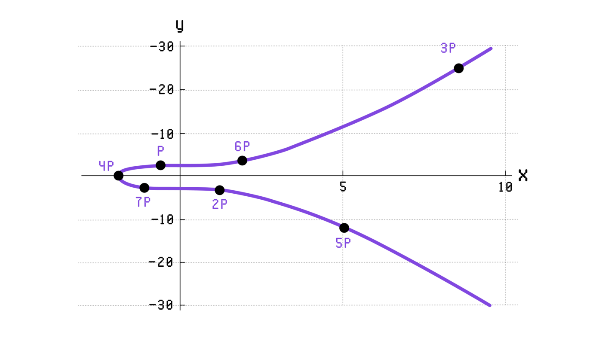

# ECDSA
ECDSA => Elliptic Curve Digital Signature Algorithm
Merhabalar, bu yazıda biraz ECDSA hakkında konuşacağız. Neymiş ne değilmiş bu arkadaş nerelerde kullanılıyormuş neden ihtiyacımız varmış bir bakalım.

Her şeyden önce Elliptic Curve Digital Signature Algorithm adından da anlaşılacağı gibi bir Digital Signature Algorithm(DSA)’dır. O yüzden temelde kısaca dijital imzaya değinmekte fayda var.

Günlük hayatta birçok belge rapor vs. evrak işlerine imzamızı atarız. Bazen bankada bazen noterde ya da iş yerimizde bir çok geleneksel imza… Bu sürekli yaptığımız bir şeydir ve taklit edilebilirliği yüzünden çokta güvenli değildir. Artık Data Integrity (Veri bütünlüğü) ve Authentication (Doğruluk) sağlanabilmesi için dijital imzalara ihtiyaç duyulmaktadır. Yani dijital ortamdaki bu imza, kimlik doğruluğunu ve mesajın içeriğine başkası tarafından müdahale edilmediğini ispatlar.

Dijitaldeki bu imzamızın gelenekselden en temel farklarından biri belgenin içeriğine göre değişmesidir. Evet sabit olmayan bir imza. Bu durum bazılarına şaşırtıcı gelse de dijital imza mesaja göre sürekli eşsiz olacak bir biçimde değişir. Son yıllarda dikkatleri üzerine çeken ve birçok dijital imza hizmetinde ve blok zincirinde kullanılan akıllı sözleşmelerde önemli bir teknik faktördür.

İleride oluşabilecek kafa karışıklığını da önlemek amacıyla iki şeye daha açıklık getirelim public (Açık) ve private (Özel) keys. Çoğumuz görmüşüzdür bir yerlerde bu iki kelimeyi, bunlar aslında düzensiz alfanümerik(harfler, sayılar gibi karakterlerden oluşan) veri dizisidir. Private olan anahtar size evinizin kapısını açarken(imza verilerini oluşturmak için kullanılabilir), public olan anahtar ise üstünde adınızın yazılı olduğu sizin orda oturduğunuzu kanıtlayan apartman zili gibidir(imza verilerini doğrulamak için kullanılabilir).

Private key adından da anlaşıldığı gibi kişiye özeldir ve yalnızca sahibi tarafından tutulur. Public key ise başkaları tarafından görülebilen ve kullanılan bir anahtardır. Public key ve private key bir çifttir ve public key private keyden oluşturulur. Ama kesinlikle public key kullanılarak private key bulunamaz. O yüzden private key sahibine özeldir.

ECDSA’ya dönecek olursak, işte bu bahsettiğim dijital imzalarda kullanılan private keyden public keyin üretilmesinde ve diğerlerinin doğrulaması için kullanmasını sağlar.

ECDSA iki şeyi temel alır biri eliptik eğriler diğeri modüler aritmetik ve Eliptik Eğri Ayrık Logaritma Problemi adı verilen matematiksel bir özellikten yararlanan bir algoritmadır. Bu özellik, günümüzün bilgisayar yeteneklerine sahip bir ortak anahtardan özel bir anahtar oluşturmayı imkansız hale getirerek, dijital imza işlemi için kullanışlı bir algoritma haline getirir.

Eliptik bir eğri, y²=x³+a∙x+b denklemi ile belirlenen bir düzlem üzerinde düzgün bir eğridir. Örneğin, Bitcoin ve Ethereum, y²=x³+7 eğrisini kullanır.


Eliptik eğrinin temel özelliği noktanın(x,y) belli bir kural kullanılarak pozitif tam sayılarla çarpılabilmesidir. Yani bu noktayı bir sayı ile çarpma kuralı onun koordinatlarını yeniden hesaplanmak için kullanılır.

Şimdi G’nin eğri üzerinde bir nokta olduğunu ve k’nın da pozitif bir tam sayı olduğunu kabul edersek k.G için olası 3 farklı konum vardır.

1- k.G = G yani G’yi k ile çarpmak bir işe yaramaz k.G noktası G ile çakışır bu durumda k tahmin edebileceğiniz gibi 1dir. Normal sayılarla olan benzetme burada çalışır.

2- k.G G ile çakışmaz ama yine de eğri üzerinde yer alır. Nokta bir şekilde eğri üzerinde kayar. Şekil 2, belirli bir P noktasının, onu 1'den 7'ye kadar tam sayılarla çarptığımızda, y²=x³+7 eğrisi boyunca nasıl kaydığını gösterir.


3- k.G yoktur yani mevcut değildir. Bunun anlamı bu nokta için koordinat hesaplama formülünde 0'a bölünme olduğunu söyler. Bunun için özel bir terim var “Özdeşlik Noktası”. Eğer k.G yoksa özdeşlik noktasına eşit olduğunu söyleyebiliriz ve k.G = 〇 olarak gösteririz.

Konu ECDSA olunca bir noktayı bir sayı ile çarpmanın ilginç bir özelliği vardır. Bir eğri üzerinde n.G = 〇 sağlayan bir G noktası düşünelim. Bu noktayı sağlayan en küçük pozitif tam sayı n olsun. O zaman G, 2.G,…(n-1)G noktalarının hepsi farklıdır. Üstelik G’yi n’den büyük sayılarla çarparsak, G bir döngüdeki konumlarını değiştirmeye başlar: (n+1)∙G=G, (n+2)∙G=2∙G, …, (n+k )∙G=k∙G (k > 0 olmalı).

Yani, G noktası, bir sayı ile çarpma sonucunda hareket edebileceği eğri üzerinde sadece n-1 pozisyona sahiptir.〇 özdeşlik noktasını dikkate alarak, k∙G için toplam n seçeneğimiz olur: bunlar G, 2∙G, …, (n-1)∙G veya 〇’dir. Bu koşullar altında, n’nin G noktasının mertebesi olduğunu söylüyoruz.

G, x ekseni üzerindeyse 2.G = 〇. Aynı zamanda 1.G = G != 〇. Yani 2, G’nin 〇 özdeşlik noktasına hareket etmesini sağlayan en küçük pozitif tam sayıdır. Bu nedenle G’nin x ekseni üzerinde olduğu durumlar için 2 seçenek vardır : Tek sayı ile çarpılınca bunlar yerinde kalır, çift sayı ile çarpılınca özdeşlik noktası olurlar. Bu yüzden bu noktaların bir mertebesi vardır ve bu mertebe 2ye eşittir.

Sonuç olarak bir noktayı tüm pozitif tamsayılarla çarptığımızda kaç farklı sonuç elde edebileceğimizi belirtmek için kelime sırasını kullanırız. G’nin mertebesi ancak n.G = 〇 olacak şekilde n varsa sonludur ve G’nin mertebesi ancak böyle bir n yoksa sonsuzdur.

ECDSA’nın, sistemdeki tüm kullanıcılar için aynı olacak beş etki alanı parametresi vardır. Bu parametrelerden ikisi ECDSA’nın modüler aritmetik kısmı ile ilgilidir, bu yüzden şimdi sadece diğer üçünden bahsedelim.

Birincisi, belirli bir eliptik eğridir. Bir eğri belirlemek için y²=x³+a∙x+b, 4∙a³+27∙b²≠0 denkleminden a ve b olmak üzere iki sayı seçmeliyiz.

İkinci parametre bir asal sayı n’dir. Asal sayı, yalnızca 1'e ve kendisine bölünebilen pozitif bir tam sayıdır.

Üçüncü parametre, eğri üzerindeki G noktasıdır ve n, G’nin mertebesidir. Bu G noktasına taban noktası denir.

Örneğin, Ethereum ve Bitcoin’in kullandığı değerlere bir bakalım.

a=0, b=7, n=FFFFFFFFFFFFFFFFFFFFFFFFFFFFFFFEBAAEDCE6AF48A03BBFD25E8CD0364141, G=(x, y), x=79BE667EF9DCBBAC55A06295CE870B07029BFCDB2DCE28D959F2815B16F81798, y=483ADA7726A3C4655DA4FBFC0E1108A8FD17B448A68554199C47D08FFB10D4B8.

Biraz da eliptik eğriler ile imza işleminden bahsedelim. Tüm imza yapılarındaki gibi, ECDSA, imza sahibinin private anahtarını kullanarak bir imza oluşturmak için kullandığı bir imza oluşturma algoritmasından ve bir doğrulayıcının imzalayanın public anahtarına verilen bir imzanın doğruluğunu kontrol etmek için kullandığı bir doğrulama algoritmasından oluşur. İmzalayan, private anahtar olarak bir sayıyı tutar ve doğrulayıcılar, public anahtarı tutar. Her ikisi de hangi eliptik eğrinin kullanılacağını, sırasını ve ayrıca bir taban noktasının koordinatlarını, G’yi önceden bilir.

Sonra mesajı imzalamak için, imzalayan ilk önce mesajı SHA-256 gibi bir algoritma ile hashini alarak 0 ile n — 1 arasında bir sayı olan bir karma değeri oluşturur. Daha sonra imzalayan kişi r = x mod n’yi ayarlar ve s = (h + rd) / k mod n’yi hesaplar ve sonrasında bu değer imza (r, s) olur.

İmza uzunluğu, kullanılan koordinatların uzunluklarına bağlıdır. Yani, koordinatların 256 bitlik sayılar olduğu bir eğriye sahipsek , r ve s’nin her ikisi de 256 bit uzunluğunda olur ve 512 bit uzunluğunda bir imza oluşturur.

Son olarak bu işlemleri Javascript kullanarak nasıl yapabiliriz bir bakalım. Starkbank’ın hafif ve hızlı ECDSA implementasyonu için bir paketi var ben bunu kullandım.

1- Kurulum: Nodejs bilgisayarınızda olması lazım olduğunu var sayarak ilerliyorum.

```
npm install starkbank-ecdsa
```
kurulumu yaptıktan sonra kodumuza geçelim
```
//Baslangıç ayarlarını yap
const ellipticcurve = require("starkbank-ecdsa");
const Ecdsa = ellipticcurve.Ecdsa;
const PrivateKey = ellipticcurve.PrivateKey;
// Public ve Private anahtarları oluştur
let privateKey = new PrivateKey();
let publicKey = privateKey.publicKey();
// Test mesajı olustur
let mesaj= "Test Mesaji";

// Imza olustur
let imza= Ecdsa.sign(mesaj, privateKey);

// Imzanın geçerliligini dogrula
console.log(Ecdsa.verify(mesaj, imza, publicKey));
```
Terminalde kodumuzu node komutu ile çalıştırıyoruz ve true sonucunu alıyoruz. Işte bu kadar kolay starkbank sağolsun :)
